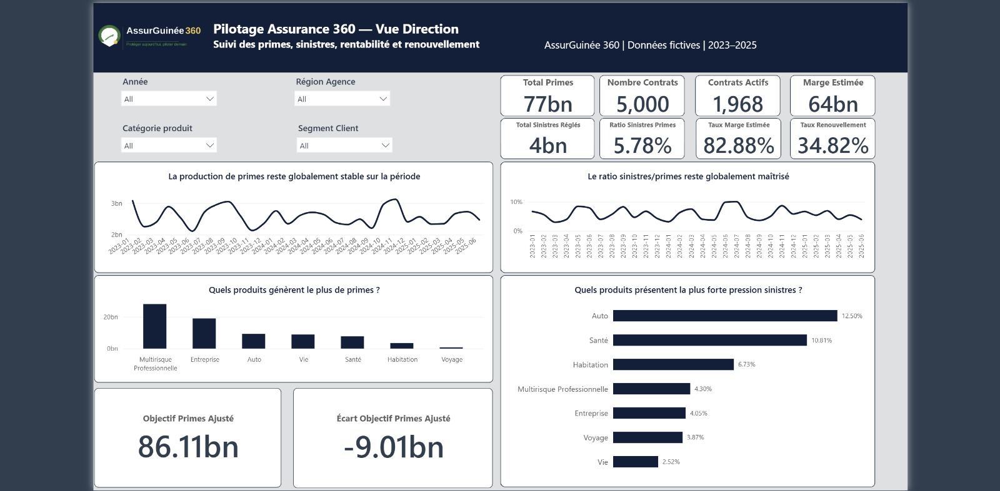
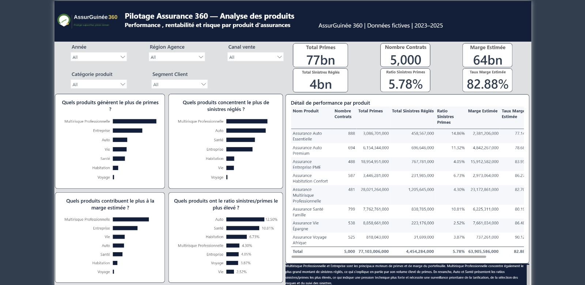
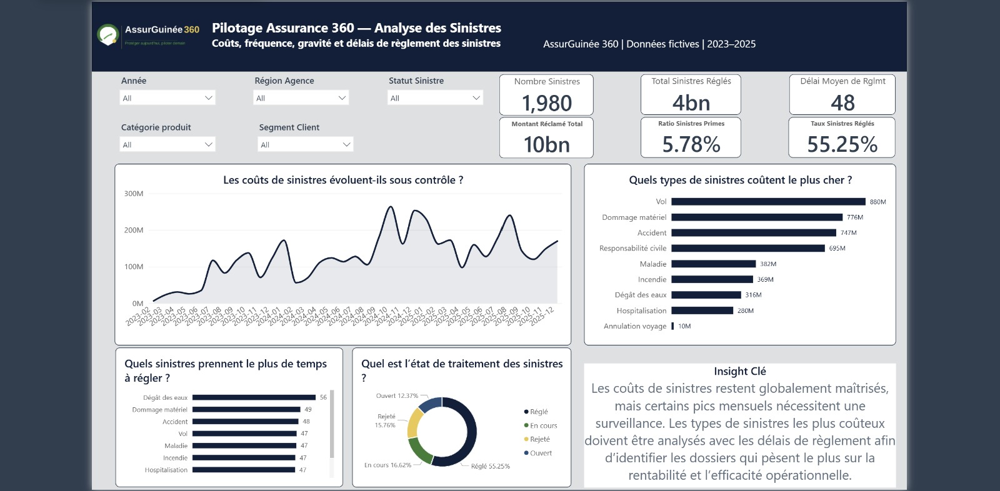
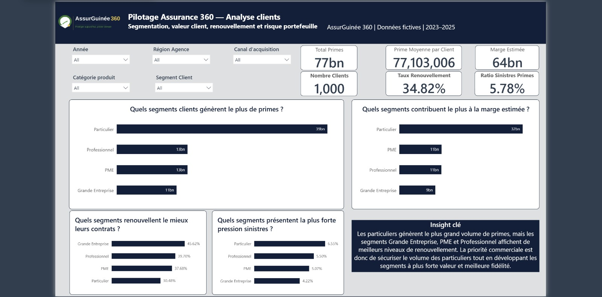
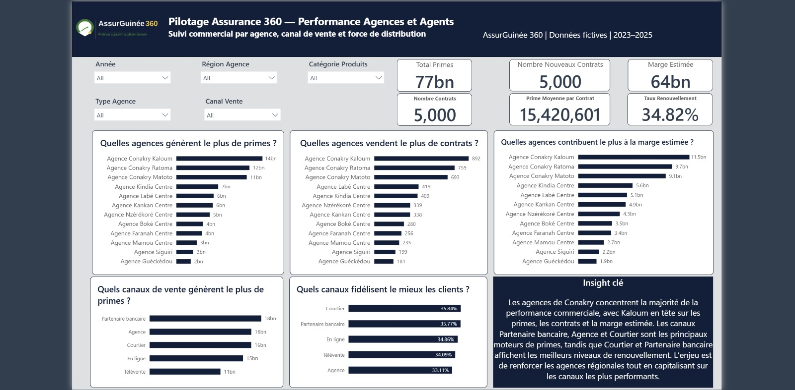

<p align="center">
  
</p>

# Pilotage Assurance 360 — Tableau de bord Power BI pour le secteur assurance en Guinée


## Contexte du projet

Ce projet est un cas fictif de Business Intelligence appliqué au secteur de l’assurance en Guinée.

L’objectif est de construire un tableau de bord Power BI permettant à une compagnie d’assurance de suivre la performance de son portefeuille à travers les primes, les contrats, les sinistres, les clients, les produits, les agences et les canaux de vente.

Les données utilisées sont fictives et ont été générées pour un projet portfolio.

---

## Objectif business

Le projet répond à la question suivante :

**Comment une compagnie d’assurance peut-elle identifier ses moteurs de croissance, ses zones de risque et ses leviers d’amélioration commerciale à partir de ses données ?**

Le dashboard permet notamment de suivre :

- les primes générées ;
- le nombre de contrats ;
- les contrats actifs ;
- les sinistres réglés ;
- le ratio sinistres/primes ;
- la marge estimée ;
- le taux de renouvellement ;
- la performance des produits ;
- la segmentation client ;
- la performance des agences et des canaux de vente.

---

## Outils utilisés

- Power BI
- Power Query
- DAX
- Python
- GitHub
- PowerPoint

---

## Structure du projet

```text
Pilotage Assurance 360_AssurGuinée 360/
│
├── donnees/
│   ├── Agences.csv
│   ├── Agents.csv
│   ├── Calendrier.csv
│   ├── Clients.csv
│   ├── Contrats.csv
│   ├── Dictionnaire_Donnees.csv
│   ├── Objectifs.csv
│   ├── Produits.csv
│   └── Sinistres.csv
│
├── powerbi/
│   └── Pilotage Assurance 360_AssurGuinée 360.pbix
│
├── scripts/
│   └── generate_assurguinee_360.py
│
├── documentation/
│   ├── insights_business.md
│   └── AssurGuinee360_Documentation_Complete.md
│
├── captures_ecran/
│   ├── 01_vue_direction.png
│   ├── 02_analyse_produits.png
│   ├── 03_analyse_sinistres.png
│   ├── 04_analyse_clients.png
│   └── 05_performance_agences.png
│
├── presentation/
│   └── pilotage_assurance_360_presentation.pptx
│
└── README.md
```
---

## Pages du dashboard

### 1. Vue Direction

Vue synthétique de la performance globale du portefeuille : primes, contrats, sinistres, marge, renouvellement et objectifs.



---

### 2. Analyse Produits

Analyse des produits d’assurance selon les primes générées, les sinistres réglés, la marge estimée et le ratio sinistres/primes.



---

### 3. Analyse Sinistres

Analyse des coûts de sinistres, de leur évolution dans le temps, de leur typologie et des délais de règlement.



---

### 4. Analyse Clients

Analyse des segments clients selon leur contribution aux primes, à la marge, au renouvellement et au risque sinistres.



---

### 5. Performance Agences et Agents

Analyse de la performance commerciale par agence, canal de vente et force de distribution.



---

## Principaux indicateurs

- Total des primes
- Nombre de contrats
- Contrats actifs
- Total des sinistres réglés
- Ratio sinistres/primes
- Marge estimée
- Taux de marge estimée
- Taux de renouvellement
- Prime moyenne par contrat
- Objectif de primes ajusté
- Écart vs objectif ajusté

---

## Insights clés

### Performance globale

Le portefeuille présente environ 77 Md GNF de primes, 5 000 contrats, une marge estimée de 64 Md GNF et un ratio sinistres/primes de 5,78 %. Ces indicateurs suggèrent une activité globalement rentable, avec une pression sinistres maîtrisée.

### Produits

Les produits Multirisque Professionnelle et Entreprise sont les principaux moteurs de primes et de marge estimée. En revanche, les produits Auto et Santé affichent les ratios sinistres/primes les plus élevés.

### Sinistres

Les coûts de sinistres restent globalement sous contrôle, mais certains pics mensuels nécessitent une surveillance. L’analyse des types de sinistres et des délais de règlement permet d’identifier les zones d’amélioration opérationnelle.

### Clients

Les particuliers génèrent le plus grand volume de primes, mais présentent une pression sinistres plus élevée et un renouvellement plus faible. Les segments Professionnel, PME et Grande Entreprise semblent plus attractifs pour la valeur long terme.

### Agences et canaux

Les agences de Conakry concentrent la majorité de la performance commerciale, avec Conakry Kaloum en tête. Les canaux Partenaire bancaire, Agence et Courtier sont les principaux moteurs de primes.

---

## Recommandations business

1. Renforcer la surveillance des produits Auto et Santé, qui présentent les ratios sinistres/primes les plus élevés.

2. Capitaliser sur les produits Multirisque Professionnelle et Entreprise, qui contribuent fortement aux primes et à la marge estimée.

3. Développer les segments Professionnel, PME et Grande Entreprise pour améliorer la valeur long terme.

4. Renforcer les agences régionales afin de réduire la dépendance commerciale aux agences de Conakry.

5. Prioriser les canaux Courtier et Partenaire bancaire, qui combinent performance commerciale et meilleur renouvellement.

---

## Limites du projet

Les données sont fictives et ont été créées pour un projet portfolio.

La marge estimée est calculée simplement à partir des primes, des sinistres réglés et des commissions. Elle ne prend pas en compte l’ensemble des charges opérationnelles, provisions techniques ou frais de gestion réels d’une compagnie d’assurance.

---

## Prochaines améliorations possibles

- Ajouter une page dédiée au renouvellement.
- Ajouter une analyse prévisionnelle des primes et des sinistres.
- Créer un scoring des contrats à risque.
- Ajouter une page de recommandations interactives.
- Publier une version template Power BI réutilisable.

---

## Auteur

Projet réalisé par **Ousmane Camara** dans le cadre d’un portfolio Data / Business Intelligence.
